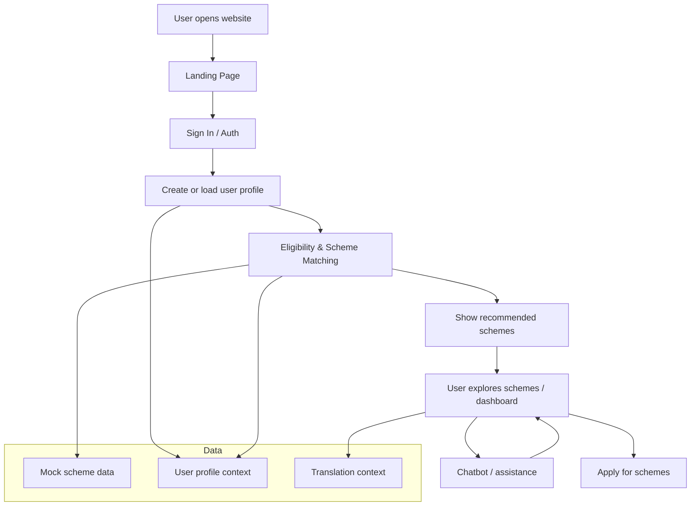

# Tech Stack

## Core
- Next.js 16
- React 19
- TypeScript

## Styling & UI
- Tailwind CSS
- PostCSS
- Framer Motion
- Lucide React

## Data & Visualization
- Recharts

## Backend / Utilities
- Node.js via Next.js API routes
- Cheerio
- Nodemailer

## Development Tools
- ESLint
- TypeScript compiler
- Node type definitions
- React type definitions

## Deployment
- Vercel-friendly Next.js project

## Flow Diagram

